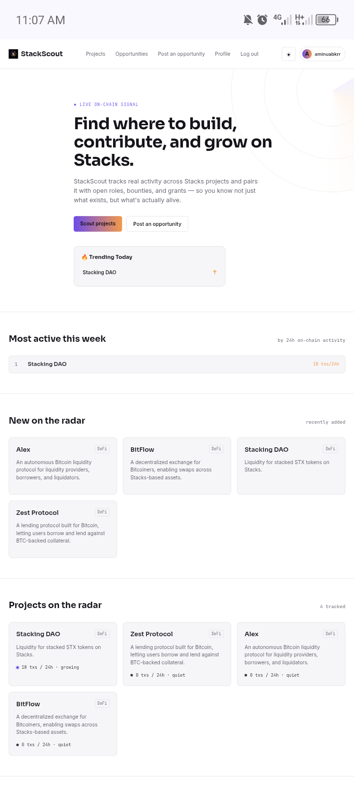
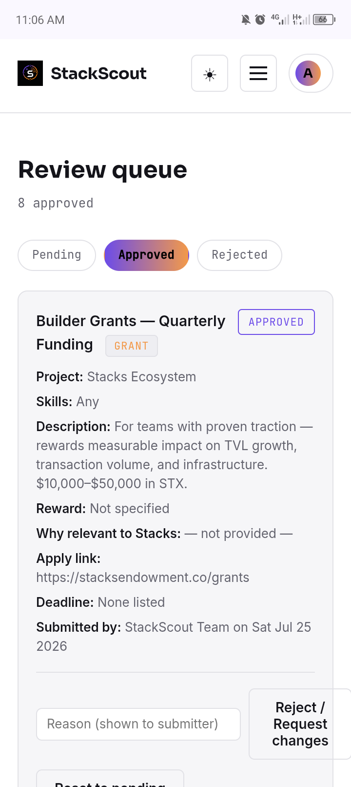
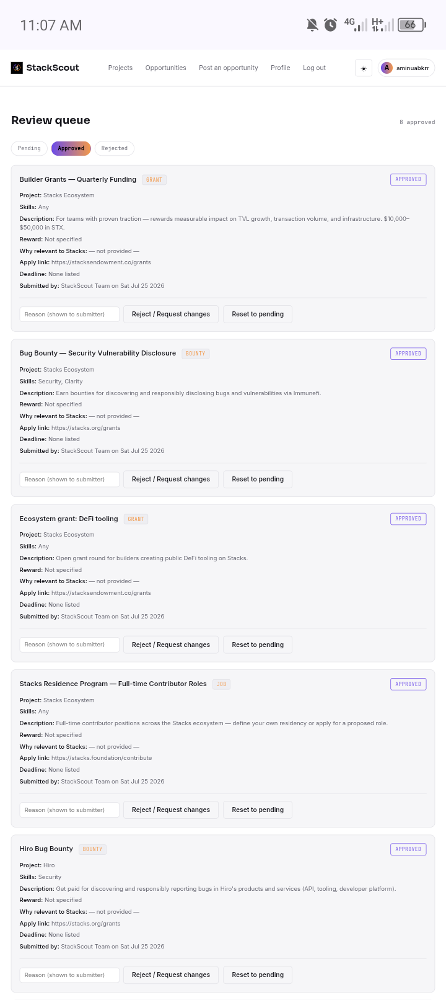

# StackScout

**Discover where to build, contribute, and grow within the Stacks ecosystem.**

Live site: [stackscout.onrender.com](https://stackscout.onrender.com)
X: [@StackScout_](https://x.com/StackScout_) · Telegram: [t.me/StackScout](https://t.me/StackScout)

---

## The Problem

Finding active projects and real opportunities across the Stacks ecosystem is difficult because the information is scattered. Builders have to manually piece together GitHub activity, project websites, Discord servers, and social media just to figure out what's actually alive and where they can contribute.

## The Solution

StackScout combines **live on-chain activity data** from the Stacks Blockchain API with a **verified opportunity board**, so builders can see not just what projects exist, but what's actually active right now — and find legitimate, reviewed ways to contribute.

## Features

- **Live project discovery** — tracked Stacks projects ranked by real 24h transaction activity, pulled directly from the Stacks Blockchain API (Hiro)
- **Trending Today** — a homepage widget surfacing the most active projects right now
- **Opportunity board** — jobs, bounties, grants, and contribution requests, filterable by type
- **Verified submissions** — every opportunity goes through an admin review queue (pending → approved/rejected) before it's publicly listed, with a mandatory "why is this relevant to Stacks" field to support review
- **StackScout Approved badge** — signals a listing passed review, without implying financial endorsement
- **Opportunity detail pages** — full context (description, requirements, reward, deadline, linked project's live activity) before a user ever clicks through to apply
- **User accounts** — sign up, log in, track your own submissions and their review status from your profile
- **Personalized feed** — select a role (developer, designer, writer, community, researcher) at signup and get a "Recommended for you" section matched to relevant opportunities
- **Dark/light mode** — adapts to system preference automatically
- **Fully responsive** — built and tested entirely on mobile

## Tech Stack

- **Backend:** Node.js, Express
- **Database:** MongoDB (Atlas)
- **Frontend:** EJS templating, custom CSS design system (no framework)
- **Auth:** JWT sessions via httpOnly cookies, bcrypt password hashing
- **On-chain data:** Stacks Blockchain API ([api.hiro.so](https://api.hiro.so))
- **Email:** Resend API
- **Scheduled jobs:** node-cron (activity refresh every 30 min, closing-soon check daily)
- **Hosting:** Render, deployed from GitHub

## How It Works

1. **Project tracking** — a background job polls the Stacks Blockchain API every 30 minutes for each tracked project's contract, deriving an activity level (`high` / `growing` / `steady` / `quiet`) from recent transaction volume.
2. **Opportunity submission** — a logged-in user submits an opportunity with a required explanation of its Stacks relevance. It's saved with `reviewStatus: pending` and is never shown publicly in this state.
3. **Admin review** — an admin dashboard (`/admin`) shows every pending submission with all the context needed to verify it: project legitimacy, Stacks relevance, apply link, submitter. The admin approves, rejects (with a note), or resets a submission.
4. **Public listing** — only `approved` opportunities appear on the homepage, project pages, and API.

## Setup

```bash
npm install
cp .env.example .env   # fill in MONGO_URI, JWT_SECRET, HIRO_API_KEY, RESEND_API_KEY
npm run seed            # loads demo project + opportunity data
npm start
```

Visit `http://localhost:3000`.

To make an account an admin, set `isAdmin: true` on that user's document directly in MongoDB.

## Screenshots

**Homepage — Trending Today, activity ranking, and project discovery**


**Admin review dashboard — full context for verifying submissions**



## Roadmap

- Historical on-chain activity trends (charts over time, not just a snapshot)
- Search and richer filtering (by skill, by "closing soon")
- Expand live tracking to every listed project (currently verified for a subset)
- Custom email domain for branded notification sending

## Built By

**Aminu Abubakar** — final-year Computer Science student, Web3 content writer and ecosystem ambassador. Built and shipped entirely from a mobile phone.
X: [@aminuabkrr](https://x.com/aminuabkrr)
